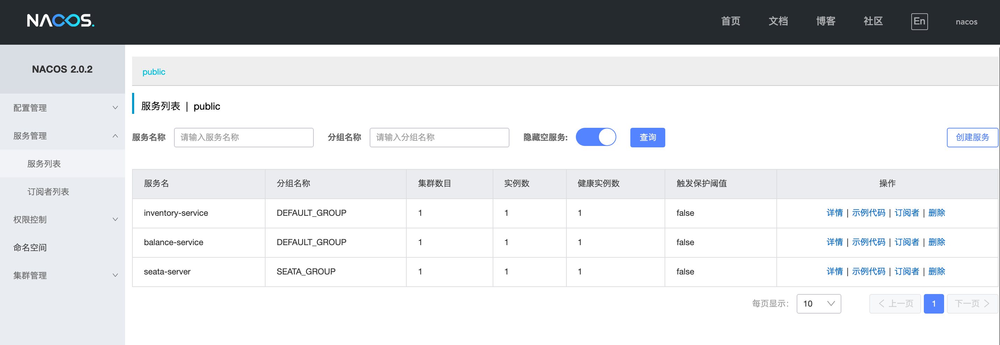

## 背景

在常规业务中，应对某系场景需求，我们希望一系列操作必须全部执行或者全部失败，这一些列操作的合集称之为事务。把业务场景放置在事务中，也就意味着该场景有了`ACID`的保证（`ACID`的相关内容不再赘述）。

在单机环境下，事务的`ACID`由数据库来提供保证（如`Mysql`的`InnerDB`引擎），而在微服务下，不同的服务可能连接着不同的数据库，彼此之间存在必然的通信延迟。此时，单单靠数据库已经无法满足跨微服务事务的`ACID`需求，于是需要分布式事务框架的支持。

在分布式事务的处理中，存在不同事务的模式，可以理解为为实现分布式事务而拟定的不同协议（某种协议对应不同的框架也会有不同的实现），目前常见的分布式事务模式有：

-   AT模式
-   TCC模式
-   Saga模式
-   XA模式

本文主要针对 **长活型事务** 的推荐解决方案 `Saga模式` 做一定的调研及落地解决方案。


## Saga模式

`Saga模式`为长活型事务的推荐解决方案。在一个长活事务中，可以包含有可以交错运行的子事务；每个子事务都是一个由数据库保持一致性的真实事务。

`Saga模式`的使用场景有：

-   业务流程长、业务步骤多
-   无法提供`TCC模式`要求的三个接口

首先业务流程长、业务步骤多的场景为典型的长活型事务场景；另外相对`TCC模式`的高要求（每个接口需要提供协议要求的三个接口），`Saga模式`只需要提供适合的补偿接口即可，相对容易实现。

在`Saga模式`中，每个子事务被称为`Ti [normal transcations]`，每个子事务对应的补偿机制，称为`Ci [compensate trancations]`。

根据事务的原子性特征，一个长活事务要么全部成功，要么全部失败，所以`Saga`的执行顺序可以概括为以下两种

-   `T1, T2, ... Tn`
-   `T1, T2, ... Tj, Cj, ... C2, C1`

执行顺序的流程图参考如下：


在上述的第二种情况中，发现异常后，`Saga`会执行对应的补偿机制，可以是数据恢复，也可以是其他（例如人工操作），并不仅仅限于数据库层面的`rollback`。

针对补偿方式的类型不同，`Saga`支持两种同步恢复策略，如下：

-   向后恢复，即补偿已完成的事务
-   向前恢复，即重试失败事务

所以`Saga`可以通过向前恢复来支持一定会成功的场景，具备最终一致性。

相对于其他模式`Saga模式`的优势有：

-   一阶段提交本地事务，无锁，高性能（涉及到多段提交，可以参考底部文档链接，不再赘述）
-   事件驱动架构，参与者可以异步执行，高吞吐
-   补偿服务易于实现

但在极端的情况下，一个`Saga事务`可以读到另一个`sage事务`的中间结果，所以`Saga模式`是不保证隔离性的。

综上所述，`Saga模式`对`ACID`的支持如下：

-   原子性：正常情况下保证，异常时不具备原子性
-   一致性：保证最终一致性
-   隔离性：不保证，即A事务可以读到B事务部分提交的结果 
-   持久性：保证

所以在使用`Saga模式`时，需要考虑其使用条件：

-   只允许两个层次的嵌套，即外层事务和子事务
-   每个子事务是独立的原子行为
-   `Ti`和`Ci`是幂等的
-   `Ci`必须可以成功
-   `Ti`和`Ci`是可交换的， 即 `Ti - Ci `和 `Ci - Ti` 执行结果一致 

在`saga`的各个子事务中，编排协作的方式分为编排和控制两种。其中编排无中央协调者，控制由中央协调者`Saga系统`实现。实际中协调可能会造成事务管理复杂，排查与修改难度大等问题，因此推荐使用控制的方式。


## Saga系统

`Saga系统`为协调各个子事务的系统。在一个分布式事务中，参与者被分为三个角色：

-   `RM [Resource Manager]`:  资源管理器
-   `TM [Transcation Manager]`: 事务管理器
-   `TC [Transcation Coordinator]`: 事务协调者

`Saga系统`则属于 `TC`。

分布式事务由`Saga系统`保证，`Saga系统`一般由高可用保证，但在高可用下依然会有异常的发生，所以需要了解`Saga系统`在各种情况下服务无效后，对`Saga事务`内各个子事务的影响。

一个`Saga系统`运行的状态，以及服务崩溃重启后的情况如下：

1.  收到事务请求，但尚未开始

    子事务对应的状态未被`Saga`修改；此时崩溃无需做任何事

2.  子事务已开始，但尚未结束

    子事务状态未知，可能失败、成功、超时；此时崩溃需要重新发起子事务（子事务幂等性要求）

3.  子事务失败，但补偿事务尚未开始

    子事务状态确认失败； 此时崩溃，需要继续执行补偿事务 

4.   补偿事务已开始，但尚未完成

    补偿事务状态未知，可能成功、失败、超时； 此时崩溃，需要重新发起补偿事务（补偿事务幂等性要求）

5.   完成一部分子事务 

     子事务状态确认成功； 此时崩溃，需要继续执行剩余子事务

目前在`Saga系统`对`Java语言`的实现有两个比较优秀的开源项目：`Seata`和`ServiceComb`，这里使用`Seata`作为具体的落地实现。


## Seata 服务器

### 简介

`Seata`是阿里巴巴的一款开源分布式事务解决方案，提供高性能和简单易用的分布式事务服务。能支持 `AT`、`TCC`、`SAGA` 和 `XA` 事务模式，示例项目中均使用`SAGA`模式来做演示。

下文均默认`seata`版本为：`1.4.2`

### 安装方式

在官网下载安装包解压后运行`sh bin/seata-server.sh`即可，其中在`conf/`目录下，有两个重要的配置文件，`file.conf`为默认的配置属性，`register.conf`为默认的注册中心与配置中心的信息，更详细的搭建`Seata 服务器`的具体步骤可参考[这里](https://github.com/rainlf/spring-cloud-alibaba-example)。

修改默认配置属性时，可参考[这里](https://seata.io/zh-cn/docs/user/configurations.html)，主要修改的内容为配置中心和注册中心的实现及相关参数。

配置中心与注册中心是`seata`的两个重要的外部组件。

### 配置中心

配置中心是`seata`与相关应用程序存放配置的地方，可以通过所需去获取对应的配置项，加载到相关的应用中。比如，`Seata Client端(TM,RM)`，`Seata Server(TC)`都会去读取全局事务开关，事务会话存储模式等信息。

配置中心默认支持`file`直连形式（快速测试用），对第三方的配置中心支持有：

1. nacos
2. consul
3. apollo
4. etcd
5. zookeeper

### 注册中心

注册中心是记录各应用服务与服务地址映射关系的地方，在分布式架构中，所有的服务都会注册到这里，当服务需要调用其他服务时，会到这里来通过服务名查找所需服务的地址进行调用。比如，`Seata Client端(TM,RM)`，发现`Seata Server(TC)集群`的地址，彼此通信。

同样注册中心也支持`file`直连形式（快速测试用），对第三方的配置中心支持有：

1. nacos
2. consul
3. eureka
4. etcd
5. zookeeper
6. sofa
7. redis

### 客户端

客户端在集成`seata`时（通常为加入了`阿里巴巴 seata-stater`依赖的`spring cloud`项目）也需要对应的上述两个文件。其中：

- `registry.conf`：用于指定`TC`的注册中心和配置文件， 同时要求 `Seata-Server` 也注册到对应的中心上 
- `file.conf`：用于指定TC的相关属性，如果使用注册中心也可以将配置添加到配置中心 （此时可省略该配置文件）

在使用`spring boot`项目时，推荐使用`properties`文件的方式配置相关属性，去除掉对上述两个文件的依赖。

### 事务分组

`seata服务器`在编排分布式事务时，存在事务分组的概念，这里加以简要说明。

事务分组为`seata`资源的逻辑隔离单位，不同是事务分组可以映射到不同的集群配置，保证了`seata`资源的灵活性，失败时也可以快速`fastover`（切换不同的事务分组即可）。

在上述的`file.conf`中，`my_test_tx_group`就是一个默认的示例事务分组。

 `TM`程序会在运行中通过事务分组的方式，找到对应的`TC`服务列表，与之进行通信，具体的步骤如下：

1. 首先程序中配置了事务分组
2. 程序会通过用户配置的配置中心去寻找`service.vgroupMapping .[事务分组配置项]`，取得配置项的值就是`TC`集群的名称
3. 拿到集群名称程序通过一定的前后缀+集群名称去构造服务名，这里各配置中心的服务名实现不同
4. 拿到服务名去相应的注册中心去拉取相应服务名的服务列表，获得后端真实的`TC`服务列表
5. 获取`TC`服务列表（示例项目中为`127.0.0.1:8091`）后，即可发起分布式事务流程

### 状态机引擎

在`Seata`中，`Saga模式`的实现是基于状态机引擎来实现的，参考官方案例的状态机如下


在该状态机中，清晰定义了哪里开始，哪里结束，以及失败时的补偿等等，`seata`依据此定义来实现分布式事务的控制。

定义状态机可通过[官方实例UI]()，也可通过本地运行[项目](https://github.com/seata/seata/tree/develop/saga/seata-saga-statemachine-designer)来实现，导出对应的`编排 Json`后即可放入项目内使用。

状态机的定义方式不在详细描述，在定义状态机时，需要关的有注状态机的属性以及状态的属性，这里做简要说明。

状态机属性：

- Name: 表示状态机的名称，必须唯一
- Comment: 状态机的描述
- Version: 状态机定义版本
- StartState: 启动时运行的第一个"状态"
- States: 状态列表，是一个map结构，key是"状态"的名称，在状态机内必须唯一
- IsRetryPersistModeUpdate: 向前重试时, 日志是否基于上次失败日志进行更新
- IsCompensatePersistModeUpdate: 向后补偿重试时, 日志是否基于上次补偿日志进行更新

状态属性：

- Type: "状态" 的类型，比如有:
  - ServiceTask: 执行调用服务任务
  - Choice: 单条件选择路由
  - CompensationTrigger: 触发补偿流程
  - Succeed: 状态机正常结束
  - Fail: 状态机异常结束
  - SubStateMachine: 调用子状态机
  - CompensateSubMachine: 用于补偿一个子状态机
- ServiceName: 服务名称，通常是服务的beanId
- ServiceMethod: 服务方法名称
- CompensateState: 该"状态"的补偿"状态"
- Loop: 标识该事务节点是否为循环事务, 即由框架本身根据循环属性的配置, 遍历集合元素对该事务节点进行循环执行
- Input: 调用服务的输入参数列表, 是一个数组, 对应于服务方法的参数列表, $.表示使用表达式从状态机上下文中取参数，表达使用的[SpringEL](https://docs.spring.io/spring/docs/4.3.10.RELEASE/spring-framework-reference/html/expressions.html), 如果是常量直接写值即可
- Ouput: 将服务返回的参数赋值到状态机上下文中, 是一个map结构，key为放入到状态机上文时的key（状态机上下文也是一个map），value中$.是表示SpringEL表达式，表示从服务的返回参数中取值，#root表示服务的整个返回参数
- Status: 服务执行状态映射，框架定义了三个状态，SU 成功、FA 失败、UN 未知, 我们需要把服务执行的状态映射成这三个状态，帮助框架判断整个事务的一致性，是一个map结构，key是条件表达式，一般是取服务的返回值或抛出的异常进行判断，默认是SpringEL表达式判断服务返回参数，带$Exception{开头表示判断异常类型。value是当这个条件表达式成立时则将服务执行状态映射成这个值
- Catch: 捕获到异常后的路由
- Next: 服务执行完成后下一个执行的"状态"
- Choices: Choice类型的"状态"里, 可选的分支列表, 分支中的Expression为SpringEL表达式, Next为当表达式成立时执行的下一个"状态"
- ErrorCode: Fail类型"状态"的错误码
- Message: Fail类型"状态"的错误信息

### 高可用

参考[这里](https://seata.io/zh-cn/docs/user/txgroup/transaction-group-and-ha.html)，不再赘述，官方推荐的最佳实践有：

1. TC的异地多机房容灾
2. 单一环境多应用接入
3. Seata的预发与生产隔离


## 示例项目

### 注意

不建议使用包含版本为`1.3.0`的`spring-cloud-starter-alibaba-seata`的`spring-cloud-alibaba-dependencies`，具体版本对照参考[这里](https://hub.fastgit.org/alibaba/spring-cloud-alibaba/wiki/%E7%89%88%E6%9C%AC%E8%AF%B4%E6%98%8E)。

该版本下，存在无法正确`properties`文件中`seata.xxx`开头的属性（`seata.service.xxx`等可以正常读取，参考该版本下`SpringBootConfigurationProvider`中引用的`StarterConstants.PROPERTY_MAP`）

由于该版本为`spring-cloud-starter-alibaba-seata`在中央`maven`版本中的最新版本，故不推荐使用`spring-cloud-alibaba`相关的方式引入相关依赖，推荐使用`seata-spring-boot-starter`。

### 示例项目1

项目 1，采用`local-bean`的方式，演示`seata`分布式事务的处理机制。

配置中心：`file`，注册中心：`file`

#### 环境

- seata server, version: 1.4.2
- spring boot, version: 2.3.7.RELEASE
- seata-spring-boot-starter, version: 1.4.2
- Java, version: jdk1.8

#### 预建表

```sql
CREATE TABLE IF NOT EXISTS `seata_state_machine_def`
(
 `id` VARCHAR(32) NOT NULL COMMENT 'id',
 `name` VARCHAR(128) NOT NULL COMMENT 'name',
 `tenant_id` VARCHAR(32) NOT NULL COMMENT 'tenant id',
 `app_name` VARCHAR(32) NOT NULL COMMENT 'application name',
 `type` VARCHAR(20) COMMENT 'state language type',
 `comment_` VARCHAR(255) COMMENT 'comment',
 `ver` VARCHAR(16) NOT NULL COMMENT 'version',
 `gmt_create` DATETIME(3) NOT NULL COMMENT 'create time',
 `status` VARCHAR(2) NOT NULL COMMENT 'status(AC:active|IN:inactive)',
 `content` TEXT COMMENT 'content',
 `recover_strategy` VARCHAR(16) COMMENT 'transaction recover strategy(compensate|retry)',
 PRIMARY KEY (`id`)
) ENGINE = InnoDB
DEFAULT CHARSET = utf8;

CREATE TABLE IF NOT EXISTS `seata_state_machine_inst`
(
 `id` VARCHAR(128) NOT NULL COMMENT 'id',
 `machine_id` VARCHAR(32) NOT NULL COMMENT 'state machine definition id',
 `tenant_id` VARCHAR(32) NOT NULL COMMENT 'tenant id',
 `parent_id` VARCHAR(128) COMMENT 'parent id',
 `gmt_started` DATETIME(3) NOT NULL COMMENT 'start time',
 `business_key` VARCHAR(48) COMMENT 'business key',
 `start_params` TEXT COMMENT 'start parameters',
 `gmt_end` DATETIME(3) COMMENT 'end time',
 `excep` BLOB COMMENT 'exception',
 `end_params` TEXT COMMENT 'end parameters',
 `status` VARCHAR(2) COMMENT 'status(SU succeed|FA failed|UN unknown|SK skipped|RU running)',
 `compensation_status` VARCHAR(2) COMMENT 'compensation status(SU succeed|FA failed|UN unknown|SK skipped|RU running)',
 `is_running` TINYINT(1) COMMENT 'is running(0 no|1 yes)',
 `gmt_updated` DATETIME(3) NOT NULL,
 PRIMARY KEY (`id`),
 UNIQUE KEY `unikey_buz_tenant` (`business_key`, `tenant_id`)
) ENGINE = InnoDB
DEFAULT CHARSET = utf8;

CREATE TABLE IF NOT EXISTS `seata_state_inst`
(
 `id` VARCHAR(48) NOT NULL COMMENT 'id',
 `machine_inst_id` VARCHAR(128) NOT NULL COMMENT 'state machine instance id',
 `name` VARCHAR(128) NOT NULL COMMENT 'state name',
 `type` VARCHAR(20) COMMENT 'state type',
 `service_name` VARCHAR(128) COMMENT 'service name',
 `service_method` VARCHAR(128) COMMENT 'method name',
 `service_type` VARCHAR(16) COMMENT 'service type',
 `business_key` VARCHAR(48) COMMENT 'business key',
 `state_id_compensated_for` VARCHAR(50) COMMENT 'state compensated for',
 `state_id_retried_for` VARCHAR(50) COMMENT 'state retried for',
 `gmt_started` DATETIME(3) NOT NULL COMMENT 'start time',
 `is_for_update` TINYINT(1) COMMENT 'is service for update',
 `input_params` TEXT COMMENT 'input parameters',
 `output_params` TEXT COMMENT 'output parameters',
 `status` VARCHAR(2) NOT NULL COMMENT 'status(SU succeed|FA failed|UN unknown|SK skipped|RU running)',
 `excep` BLOB COMMENT 'exception',
 `gmt_updated` DATETIME(3) COMMENT 'update time',
 `gmt_end` DATETIME(3) COMMENT 'end time',
 PRIMARY KEY (`id`, `machine_inst_id`)
) ENGINE = InnoDB
DEFAULT CHARSET = utf8;
```

#### 配置项

```
seata.enabled=true
seata.tx-service-group=local_saga
seata.service.vgroup-mapping.local_saga=seata-server
seata.service.grouplist.seata-server=127.0.0.1:8091
seata.client.rm.saga-json-parser=fastjson
seata.client.rm.report-success-enable=true
seata.client.rm.report-retry-count=1
seata.client.tm.commit-retry-count=1
seata.client.tm.rollback-retry-count=1
seata.client.tm.degrade-check-allow-times=1
```

#### 子事务

这里参考官方实例，包含两个子事务：库存递减和余额递减

```java
@Slf4j
@Service("inventoryAction")
public class InventoryActionImpl implements InventoryAction {

    @Override
    public boolean reduce(String businessKey, int count) {
        log.info("reduce inventory succeed, count: " + count + ", businessKey:" + businessKey);
        return true;
    }

    @Override
    public boolean compensateReduce(String businessKey) {
        log.info("compensate reduce inventory succeed, businessKey:" + businessKey);
        return true;
    }
}
```

```java
@Slf4j
@Service("balanceAction")
public class BalanceActionImpl implements BalanceAction {

    @Override
    public boolean reduce(String businessKey, BigDecimal amount, Map<String, Object> params) {
        if(params != null && "true".equals(params.get("throwException"))){
            throw new RuntimeException("reduce balance failed");
        }
        log.info("reduce balance succeed, amount: " + amount + ", businessKey:" + businessKey);
        return true;
    }

    @Override
    public boolean compensateReduce(String businessKey, Map<String, Object> params) {
        if(params != null && "true".equals(params.get("throwException"))){
            throw new RuntimeException("compensate reduce balance failed");
        }
        log.info("compensate reduce balance succeed, businessKey:" + businessKey);
        return true;
    }
}
```

####  Saga 配置

```java
@Configuration
public class StateMachineEngineConfig{
    @Bean
    public DbStateMachineConfig dbStateMachineConfig(DataSource dataSource){
        DbStateMachineConfig stateMachineConfig = new DbStateMachineConfig();
        stateMachineConfig.setDataSource(dataSource);
        Resource resource = new ClassPathResource("statelang/reduce_inventory_and_balance.json");
        stateMachineConfig.setResources(new Resource[]{resource});
        stateMachineConfig.setEnableAsync(true);
        stateMachineConfig.setThreadPoolExecutor(threadExecutor());
        return stateMachineConfig;
    }

      @Bean
      public StateMachineEngine stateMachineEngine(DbStateMachineConfig dbStateMachineConfig){
          ProcessCtrlStateMachineEngine processCtrlStateMachineEngine = new ProcessCtrlStateMachineEngine();
          processCtrlStateMachineEngine.setStateMachineConfig(dbStateMachineConfig);
          return processCtrlStateMachineEngine;
      }


    @Bean
    public StateMachineEngineHolder stateMachineEngineHolder(StateMachineEngine stateMachineEngine){
        StateMachineEngineHolder engineHolder = new StateMachineEngineHolder();
        engineHolder.setStateMachineEngine(stateMachineEngine);
        return engineHolder;
    }


    @Bean
    public ThreadPoolExecutor threadExecutor(){
        ThreadPoolTaskExecutor executor = new ThreadPoolTaskExecutor();
        //配置核心线程数
        executor.setCorePoolSize(1);
        //配置最大线程数
        executor.setMaxPoolSize(20);
        //配置队列大小
        executor.setQueueCapacity(99999);
        //配置线程池中的线程的名称前缀
        executor.setThreadNamePrefix("SAGA_ASYNC_EXE_");

        // 设置拒绝策略：当pool已经达到max size的时候，如何处理新任务
        // CALLER_RUNS：不在新线程中执行任务，而是有调用者所在的线程来执行
        executor.setRejectedExecutionHandler(new ThreadPoolExecutor.CallerRunsPolicy());
        //执行初始化
        executor.initialize();
        return executor.getThreadPoolExecutor();
    }
}
```

#### 状态机文件

```json
{
    "Name": "reduceInventoryAndBalance",
    "Comment": "reduce inventory then reduce balance in a transaction",
    "StartState": "ReduceInventory",
    "Version": "0.0.1",
    "States": {
        "ReduceInventory": {
            "Type": "ServiceTask",
            "ServiceName": "inventoryAction",
            "ServiceMethod": "reduce",
            "CompensateState": "CompensateReduceInventory",
            "Next": "ChoiceState",
            "Input": [
                "$.[businessKey]",
                "$.[count]"
            ],
            "Output": {
                "reduceInventoryResult": "$.#root"
            },
            "Status": {
                "#root == true": "SU",
                "#root == false": "FA",
                "$Exception{java.lang.Throwable}": "UN"
            }
        },
        "ChoiceState":{
            "Type": "Choice",
            "Choices":[
                {
                    "Expression":"[reduceInventoryResult] == true",
                    "Next":"ReduceBalance"
                }
            ],
            "Default":"Fail"
        },
        "ReduceBalance": {
            "Type": "ServiceTask",
            "ServiceName": "balanceAction",
            "ServiceMethod": "reduce",
            "CompensateState": "CompensateReduceBalance",
            "Input": [
                "$.[businessKey]",
                "$.[amount]",
                {
                    "throwException" : "$.[mockReduceBalanceFail]"
                }
            ],
            "Output": {
                "compensateReduceBalanceResult": "$.#root"
            },
            "Status": {
                "#root == true": "SU",
                "#root == false": "FA",
                "$Exception{java.lang.Throwable}": "UN"
            },
            "Catch": [
                {
                    "Exceptions": [
                        "java.lang.Throwable"
                    ],
                    "Next": "CompensationTrigger"
                }
            ],
            "Next": "Succeed"
        },
        "CompensateReduceInventory": {
            "Type": "ServiceTask",
            "ServiceName": "inventoryAction",
            "ServiceMethod": "compensateReduce",
            "Input": [
                "$.[businessKey]"
            ]
        },
        "CompensateReduceBalance": {
            "Type": "ServiceTask",
            "ServiceName": "balanceAction",
            "ServiceMethod": "compensateReduce",
            "Input": [
                "$.[businessKey]"
            ]
        },
        "CompensationTrigger": {
            "Type": "CompensationTrigger",
            "Next": "Fail"
        },
        "Succeed": {
            "Type":"Succeed"
        },
        "Fail": {
            "Type":"Fail",
            "ErrorCode": "PURCHASE_FAILED",
            "Message": "purchase failed"
        }
    }
}
```

#### 测试接口

```java
@Slf4j
@RestController
public class TestController {
    @Autowired
    private StateMachineEngine stateMachineEngine;


    @GetMapping("commit")
    public void commitSaga() {
        Map<String, Object> startParams = new HashMap<>(3);
        String businessKey = String.valueOf(System.currentTimeMillis());
        startParams.put("businessKey", businessKey);
        startParams.put("count", 10);
        startParams.put("amount", new BigDecimal("100"));

        //sync test
        StateMachineInstance inst = stateMachineEngine.startWithBusinessKey("reduceInventoryAndBalance", null, businessKey, startParams);

        Assert.isTrue(ExecutionStatus.SU.equals(inst.getStatus()), "saga transaction execute failed. XID: " + inst.getId());
        System.out.println("saga transaction commit succeed. XID: " + inst.getId());

        inst = stateMachineEngine.getStateMachineConfig().getStateLogStore().getStateMachineInstanceByBusinessKey(businessKey, null);
        Assert.isTrue(ExecutionStatus.SU.equals(inst.getStatus()), "saga transaction execute failed. XID: " + inst.getId());

        //async test
        businessKey = String.valueOf(System.currentTimeMillis());
        inst = stateMachineEngine.startWithBusinessKeyAsync("reduceInventoryAndBalance", null, businessKey, startParams, CALL_BACK);

        waittingForFinish(inst);

        Assert.isTrue(ExecutionStatus.SU.equals(inst.getStatus()), "saga transaction execute failed. XID: " + inst.getId());
        System.out.println("saga transaction commit succeed. XID: " + inst.getId());
    }

    @GetMapping("compensate")
    public void compensateSaga() {
        Map<String, Object> startParams = new HashMap<>(4);
        String businessKey = String.valueOf(System.currentTimeMillis());
        startParams.put("businessKey", businessKey);
        startParams.put("count", 10);
        startParams.put("amount", new BigDecimal("100"));
        startParams.put("mockReduceBalanceFail", "true");

        //sync test
        StateMachineInstance inst = stateMachineEngine.startWithBusinessKey("reduceInventoryAndBalance", null, businessKey, startParams);

        //async test
        businessKey = String.valueOf(System.currentTimeMillis());
        inst = stateMachineEngine.startWithBusinessKeyAsync("reduceInventoryAndBalance", null, businessKey, startParams, CALL_BACK);

        waittingForFinish(inst);

        Assert.isTrue(ExecutionStatus.SU.equals(inst.getCompensationStatus()), "saga transaction compensate failed. XID: " + inst.getId());
        System.out.println("saga transaction compensate succeed. XID: " + inst.getId());
    }


    private static final Object lock = new Object();
    private static final AsyncCallback CALL_BACK = new AsyncCallback() {
        @Override
        public void onFinished(ProcessContext context, StateMachineInstance stateMachineInstance) {
            synchronized (lock){
                lock.notifyAll();
            }
        }

        @Override
        public void onError(ProcessContext context, StateMachineInstance stateMachineInstance, Exception exp) {
            synchronized (lock){
                lock.notifyAll();
            }
        }
    };

    private static void waittingForFinish(StateMachineInstance inst){
        synchronized (lock){
            if(ExecutionStatus.RU.equals(inst.getStatus())){
                try {
                    lock.wait();
                } catch (InterruptedException e) {
                    e.printStackTrace();
                }
            }
        }
    }
}
```

#### 演示

先启动`seata`服务器，启动项目后可以观察到日志

```log
Initializing Global Transaction Clients ... 
2021-07-25 20:00:38.301  INFO 6856 --- [           main] i.s.s.t.DefaultSagaTransactionalTemplate : Transaction Manager Client is initialized. applicationId[seata-saga-test] txServiceGroup[local_saga]
2021-07-25 20:00:38.301  INFO 6856 --- [           main] i.s.s.t.DefaultSagaTransactionalTemplate : Resource Manager is initialized. applicationId[seata-saga-test] txServiceGroup[local_saga]
2021-07-25 20:00:38.309  INFO 6856 --- [           main] i.s.c.r.netty.NettyClientChannelManager  : will connect to 127.0.0.1:8091
2021-07-25 20:00:38.309  INFO 6856 --- [           main] i.s.c.rpc.netty.RmNettyRemotingClient    : RM will register :seata-saga-test#local_saga
2021-07-25 20:00:38.311  INFO 6856 --- [           main] i.s.core.rpc.netty.NettyPoolableFactory  : NettyPool create channel to transactionRole:RMROLE,address:127.0.0.1:8091,msg:< RegisterRMRequest{resourceIds='seata-saga-test#local_saga', applicationId='seata-saga-test', transactionServiceGroup='local_saga'} >
2021-07-25 20:00:38.502  INFO 6856 --- [           main] i.s.c.rpc.netty.RmNettyRemotingClient    : register RM success. client version:1.4.2, server version:1.4.2,channel:[id: 0x041e4d10, L:/127.0.0.1:54614 - R:/127.0.0.1:8091]
2021-07-25 20:00:38.516  INFO 6856 --- [           main] i.s.core.rpc.netty.NettyPoolableFactory  : register success, cost 109 ms, version:1.4.2,role:RMROLE,channel:[id: 0x041e4d10, L:/127.0.0.1:54614 - R:/127.0.0.1:8091]
2021-07-25 20:00:38.517  INFO 6856 --- [           main] i.s.s.t.DefaultSagaTransactionalTemplate : Global Transaction Clients are initialized. 
```

表示`TM`，`RM`已经链接到`TC`

访问`curl localhost:8080/commit`，可以看到事务正常结束的日志

```
# sync test
reduce inventory succeed, count: 10, businessKey:1627226611826
reduce balance succeed, amount: 100, businessKey:1627226611826
saga transaction commit succeed. XID: 192.168.0.109:8091:8151674177725206531

# async test
reduce inventory succeed, count: 10, businessKey:1627226611826
reduce balance succeed, amount: 100, businessKey:1627226611826
saga transaction commit succeed. XID: 192.168.0.109:8091:8151674177725206532
```

访问`curl localhost:8080/compensate`，可以看到事务异常结束，出现补偿的日志

```
# sync test
reduce inventory succeed, count: 10, businessKey:1627227580460
reduce balance failed
compensate reduce balance succeed, businessKey:1627227580460
compensate reduce inventory succeed, businessKey:1627227580460
saga transaction compensate succeed. XID: 192.168.0.109:8091:8151674177725206533

# async test
reduce inventory succeed, count: 10, businessKey:1627227580460
reduce balance failed
compensate reduce balance succeed, businessKey:1627227580460
compensate reduce inventory succeed, businessKey:1627227580460
saga transaction compensate succeed. XID: 192.168.0.109:8091:8151674177725206534
```

### 示例项目 2

项目 2，采用分布式架构的方式，演示`seata-saga`模式的落地实现。

项目内设定子项目由示例项目 1 而来，将`inventory-service`和`balance-service`分为两个微服务项目部署。

配置中心：`nacos`，注册中心：`nacos`

`nacos`配置中心的初始化和集成参考[这里](https://seata.io/zh-cn/docs/user/configuration/nacos.html)

`nacos`注册中心的初始化和集成参考[这里](https://seata.io/zh-cn/docs/user/registry/nacos.html)

这里记录比较重要的修改信息。

#### Nacos 服务器

##### 数据库

`nacoa`使用`db`作为数据存储时的`schema`脚本

```sql
DROP DATABASE IF EXISTS nacos;
CREATE DATABASE nacos COLLATE utf8_bin;
USE nacos;

/******************************************/
/*   数据库全名 = nacos_config   */
/*   表名称 = config_info   */
/******************************************/
CREATE TABLE `config_info` (
  `id` bigint(20) NOT NULL AUTO_INCREMENT COMMENT 'id',
  `data_id` varchar(255) NOT NULL COMMENT 'data_id',
  `group_id` varchar(255) DEFAULT NULL,
  `content` longtext NOT NULL COMMENT 'content',
  `md5` varchar(32) DEFAULT NULL COMMENT 'md5',
  `gmt_create` datetime NOT NULL DEFAULT CURRENT_TIMESTAMP COMMENT '创建时间',
  `gmt_modified` datetime NOT NULL DEFAULT CURRENT_TIMESTAMP COMMENT '修改时间',
  `src_user` text COMMENT 'source user',
  `src_ip` varchar(50) DEFAULT NULL COMMENT 'source ip',
  `app_name` varchar(128) DEFAULT NULL,
  `tenant_id` varchar(128) DEFAULT '' COMMENT '租户字段',
  `c_desc` varchar(256) DEFAULT NULL,
  `c_use` varchar(64) DEFAULT NULL,
  `effect` varchar(64) DEFAULT NULL,
  `type` varchar(64) DEFAULT NULL,
  `c_schema` text,
  PRIMARY KEY (`id`),
  UNIQUE KEY `uk_configinfo_datagrouptenant` (`data_id`,`group_id`,`tenant_id`)
) ENGINE=InnoDB DEFAULT CHARSET=utf8 COLLATE=utf8_bin COMMENT='config_info';

/******************************************/
/*   数据库全名 = nacos_config   */
/*   表名称 = config_info_aggr   */
/******************************************/
CREATE TABLE `config_info_aggr` (
  `id` bigint(20) NOT NULL AUTO_INCREMENT COMMENT 'id',
  `data_id` varchar(255) NOT NULL COMMENT 'data_id',
  `group_id` varchar(255) NOT NULL COMMENT 'group_id',
  `datum_id` varchar(255) NOT NULL COMMENT 'datum_id',
  `content` longtext NOT NULL COMMENT '内容',
  `gmt_modified` datetime NOT NULL COMMENT '修改时间',
  `app_name` varchar(128) DEFAULT NULL,
  `tenant_id` varchar(128) DEFAULT '' COMMENT '租户字段',
  PRIMARY KEY (`id`),
  UNIQUE KEY `uk_configinfoaggr_datagrouptenantdatum` (`data_id`,`group_id`,`tenant_id`,`datum_id`)
) ENGINE=InnoDB DEFAULT CHARSET=utf8 COLLATE=utf8_bin COMMENT='增加租户字段';


/******************************************/
/*   数据库全名 = nacos_config   */
/*   表名称 = config_info_beta   */
/******************************************/
CREATE TABLE `config_info_beta` (
  `id` bigint(20) NOT NULL AUTO_INCREMENT COMMENT 'id',
  `data_id` varchar(255) NOT NULL COMMENT 'data_id',
  `group_id` varchar(128) NOT NULL COMMENT 'group_id',
  `app_name` varchar(128) DEFAULT NULL COMMENT 'app_name',
  `content` longtext NOT NULL COMMENT 'content',
  `beta_ips` varchar(1024) DEFAULT NULL COMMENT 'betaIps',
  `md5` varchar(32) DEFAULT NULL COMMENT 'md5',
  `gmt_create` datetime NOT NULL DEFAULT CURRENT_TIMESTAMP COMMENT '创建时间',
  `gmt_modified` datetime NOT NULL DEFAULT CURRENT_TIMESTAMP COMMENT '修改时间',
  `src_user` text COMMENT 'source user',
  `src_ip` varchar(50) DEFAULT NULL COMMENT 'source ip',
  `tenant_id` varchar(128) DEFAULT '' COMMENT '租户字段',
  PRIMARY KEY (`id`),
  UNIQUE KEY `uk_configinfobeta_datagrouptenant` (`data_id`,`group_id`,`tenant_id`)
) ENGINE=InnoDB DEFAULT CHARSET=utf8 COLLATE=utf8_bin COMMENT='config_info_beta';

/******************************************/
/*   数据库全名 = nacos_config   */
/*   表名称 = config_info_tag   */
/******************************************/
CREATE TABLE `config_info_tag` (
  `id` bigint(20) NOT NULL AUTO_INCREMENT COMMENT 'id',
  `data_id` varchar(255) NOT NULL COMMENT 'data_id',
  `group_id` varchar(128) NOT NULL COMMENT 'group_id',
  `tenant_id` varchar(128) DEFAULT '' COMMENT 'tenant_id',
  `tag_id` varchar(128) NOT NULL COMMENT 'tag_id',
  `app_name` varchar(128) DEFAULT NULL COMMENT 'app_name',
  `content` longtext NOT NULL COMMENT 'content',
  `md5` varchar(32) DEFAULT NULL COMMENT 'md5',
  `gmt_create` datetime NOT NULL DEFAULT CURRENT_TIMESTAMP COMMENT '创建时间',
  `gmt_modified` datetime NOT NULL DEFAULT CURRENT_TIMESTAMP COMMENT '修改时间',
  `src_user` text COMMENT 'source user',
  `src_ip` varchar(50) DEFAULT NULL COMMENT 'source ip',
  PRIMARY KEY (`id`),
  UNIQUE KEY `uk_configinfotag_datagrouptenanttag` (`data_id`,`group_id`,`tenant_id`,`tag_id`)
) ENGINE=InnoDB DEFAULT CHARSET=utf8 COLLATE=utf8_bin COMMENT='config_info_tag';

/******************************************/
/*   数据库全名 = nacos_config   */
/*   表名称 = config_tags_relation   */
/******************************************/
CREATE TABLE `config_tags_relation` (
  `id` bigint(20) NOT NULL COMMENT 'id',
  `tag_name` varchar(128) NOT NULL COMMENT 'tag_name',
  `tag_type` varchar(64) DEFAULT NULL COMMENT 'tag_type',
  `data_id` varchar(255) NOT NULL COMMENT 'data_id',
  `group_id` varchar(128) NOT NULL COMMENT 'group_id',
  `tenant_id` varchar(128) DEFAULT '' COMMENT 'tenant_id',
  `nid` bigint(20) NOT NULL AUTO_INCREMENT,
  PRIMARY KEY (`nid`),
  UNIQUE KEY `uk_configtagrelation_configidtag` (`id`,`tag_name`,`tag_type`),
  KEY `idx_tenant_id` (`tenant_id`)
) ENGINE=InnoDB DEFAULT CHARSET=utf8 COLLATE=utf8_bin COMMENT='config_tag_relation';

/******************************************/
/*   数据库全名 = nacos_config   */
/*   表名称 = group_capacity   */
/******************************************/
CREATE TABLE `group_capacity` (
  `id` bigint(20) unsigned NOT NULL AUTO_INCREMENT COMMENT '主键ID',
  `group_id` varchar(128) NOT NULL DEFAULT '' COMMENT 'Group ID，空字符表示整个集群',
  `quota` int(10) unsigned NOT NULL DEFAULT '0' COMMENT '配额，0表示使用默认值',
  `usage` int(10) unsigned NOT NULL DEFAULT '0' COMMENT '使用量',
  `max_size` int(10) unsigned NOT NULL DEFAULT '0' COMMENT '单个配置大小上限，单位为字节，0表示使用默认值',
  `max_aggr_count` int(10) unsigned NOT NULL DEFAULT '0' COMMENT '聚合子配置最大个数，，0表示使用默认值',
  `max_aggr_size` int(10) unsigned NOT NULL DEFAULT '0' COMMENT '单个聚合数据的子配置大小上限，单位为字节，0表示使用默认值',
  `max_history_count` int(10) unsigned NOT NULL DEFAULT '0' COMMENT '最大变更历史数量',
  `gmt_create` datetime NOT NULL DEFAULT CURRENT_TIMESTAMP COMMENT '创建时间',
  `gmt_modified` datetime NOT NULL DEFAULT CURRENT_TIMESTAMP COMMENT '修改时间',
  PRIMARY KEY (`id`),
  UNIQUE KEY `uk_group_id` (`group_id`)
) ENGINE=InnoDB DEFAULT CHARSET=utf8 COLLATE=utf8_bin COMMENT='集群、各Group容量信息表';

/******************************************/
/*   数据库全名 = nacos_config   */
/*   表名称 = his_config_info   */
/******************************************/
CREATE TABLE `his_config_info` (
  `id` bigint(64) unsigned NOT NULL,
  `nid` bigint(20) unsigned NOT NULL AUTO_INCREMENT,
  `data_id` varchar(255) NOT NULL,
  `group_id` varchar(128) NOT NULL,
  `app_name` varchar(128) DEFAULT NULL COMMENT 'app_name',
  `content` longtext NOT NULL,
  `md5` varchar(32) DEFAULT NULL,
  `gmt_create` datetime NOT NULL DEFAULT CURRENT_TIMESTAMP,
  `gmt_modified` datetime NOT NULL DEFAULT CURRENT_TIMESTAMP,
  `src_user` text,
  `src_ip` varchar(50) DEFAULT NULL,
  `op_type` char(10) DEFAULT NULL,
  `tenant_id` varchar(128) DEFAULT '' COMMENT '租户字段',
  PRIMARY KEY (`nid`),
  KEY `idx_gmt_create` (`gmt_create`),
  KEY `idx_gmt_modified` (`gmt_modified`),
  KEY `idx_did` (`data_id`)
) ENGINE=InnoDB DEFAULT CHARSET=utf8 COLLATE=utf8_bin COMMENT='多租户改造';


/******************************************/
/*   数据库全名 = nacos_config   */
/*   表名称 = tenant_capacity   */
/******************************************/
CREATE TABLE `tenant_capacity` (
  `id` bigint(20) unsigned NOT NULL AUTO_INCREMENT COMMENT '主键ID',
  `tenant_id` varchar(128) NOT NULL DEFAULT '' COMMENT 'Tenant ID',
  `quota` int(10) unsigned NOT NULL DEFAULT '0' COMMENT '配额，0表示使用默认值',
  `usage` int(10) unsigned NOT NULL DEFAULT '0' COMMENT '使用量',
  `max_size` int(10) unsigned NOT NULL DEFAULT '0' COMMENT '单个配置大小上限，单位为字节，0表示使用默认值',
  `max_aggr_count` int(10) unsigned NOT NULL DEFAULT '0' COMMENT '聚合子配置最大个数',
  `max_aggr_size` int(10) unsigned NOT NULL DEFAULT '0' COMMENT '单个聚合数据的子配置大小上限，单位为字节，0表示使用默认值',
  `max_history_count` int(10) unsigned NOT NULL DEFAULT '0' COMMENT '最大变更历史数量',
  `gmt_create` datetime NOT NULL DEFAULT CURRENT_TIMESTAMP COMMENT '创建时间',
  `gmt_modified` datetime NOT NULL DEFAULT CURRENT_TIMESTAMP COMMENT '修改时间',
  PRIMARY KEY (`id`),
  UNIQUE KEY `uk_tenant_id` (`tenant_id`)
) ENGINE=InnoDB DEFAULT CHARSET=utf8 COLLATE=utf8_bin COMMENT='租户容量信息表';


CREATE TABLE `tenant_info` (
  `id` bigint(20) NOT NULL AUTO_INCREMENT COMMENT 'id',
  `kp` varchar(128) NOT NULL COMMENT 'kp',
  `tenant_id` varchar(128) default '' COMMENT 'tenant_id',
  `tenant_name` varchar(128) default '' COMMENT 'tenant_name',
  `tenant_desc` varchar(256) DEFAULT NULL COMMENT 'tenant_desc',
  `create_source` varchar(32) DEFAULT NULL COMMENT 'create_source',
  `gmt_create` bigint(20) NOT NULL COMMENT '创建时间',
  `gmt_modified` bigint(20) NOT NULL COMMENT '修改时间',
  PRIMARY KEY (`id`),
  UNIQUE KEY `uk_tenant_info_kptenantid` (`kp`,`tenant_id`),
  KEY `idx_tenant_id` (`tenant_id`)
) ENGINE=InnoDB DEFAULT CHARSET=utf8 COLLATE=utf8_bin COMMENT='tenant_info';

CREATE TABLE `users` (
	`username` varchar(50) NOT NULL PRIMARY KEY,
	`password` varchar(500) NOT NULL,
	`enabled` boolean NOT NULL
);

CREATE TABLE `roles` (
	`username` varchar(50) NOT NULL,
	`role` varchar(50) NOT NULL,
	UNIQUE INDEX `idx_user_role` (`username` ASC, `role` ASC) USING BTREE
);

CREATE TABLE `permissions` (
    `role` varchar(50) NOT NULL,
    `resource` varchar(255) NOT NULL,
    `action` varchar(8) NOT NULL,
    UNIQUE INDEX `uk_role_permission` (`role`,`resource`,`action`) USING BTREE
);

INSERT INTO users (username, password, enabled) VALUES ('nacos', '$2a$10$EuWPZHzz32dJN7jexM34MOeYirDdFAZm2kuWj7VEOJhhZkDrxfvUu', TRUE);

INSERT INTO roles (username, role) VALUES ('nacos', 'ROLE_ADMIN');

```

##### 配置

修改`nacos`服务器配置文件`conf/application.properties`

```properties
### If use MySQL as datasource:
spring.datasource.platform=mysql

### Count of DB:
db.num=1

### Connect URL of DB:
db.url.0=jdbc:mysql://127.0.0.1:3306/nacos?characterEncoding=utf8&connectTimeout=1000&socketTimeout=3000&autoReconnect=true&useUnicode=true&useSSL=false&serverTimezone=UTC
db.user.0=root
db.password.0=root
```

##### 启动

```shell
sh startup.sh -m standalone
```

#### Seata服务器

##### 数据库

`seata`服务器使用`db`作为数据存储的`sehema`脚本

```sql
-- -------------------------------- The script used when storeMode is 'db' --------------------------------
CREATE DATABASE IF NOT EXISTS seata;
USE seata;
-- the table to store GlobalSession data
CREATE TABLE IF NOT EXISTS `global_table`
(
    `xid`                       VARCHAR(128) NOT NULL,
    `transaction_id`            BIGINT,
    `status`                    TINYINT      NOT NULL,
    `application_id`            VARCHAR(32),
    `transaction_service_group` VARCHAR(32),
    `transaction_name`          VARCHAR(128),
    `timeout`                   INT,
    `begin_time`                BIGINT,
    `application_data`          VARCHAR(2000),
    `gmt_create`                DATETIME,
    `gmt_modified`              DATETIME,
    PRIMARY KEY (`xid`),
    KEY `idx_gmt_modified_status` (`gmt_modified`, `status`),
    KEY `idx_transaction_id` (`transaction_id`)
) ENGINE = InnoDB
  DEFAULT CHARSET = utf8;

-- the table to store BranchSession data
CREATE TABLE IF NOT EXISTS `branch_table`
(
    `branch_id`         BIGINT       NOT NULL,
    `xid`               VARCHAR(128) NOT NULL,
    `transaction_id`    BIGINT,
    `resource_group_id` VARCHAR(32),
    `resource_id`       VARCHAR(256),
    `branch_type`       VARCHAR(8),
    `status`            TINYINT,
    `client_id`         VARCHAR(64),
    `application_data`  VARCHAR(2000),
    `gmt_create`        DATETIME(6),
    `gmt_modified`      DATETIME(6),
    PRIMARY KEY (`branch_id`),
    KEY `idx_xid` (`xid`)
) ENGINE = InnoDB
  DEFAULT CHARSET = utf8;

-- the table to store lock data
CREATE TABLE IF NOT EXISTS `lock_table`
(
    `row_key`        VARCHAR(128) NOT NULL,
    `xid`            VARCHAR(128),
    `transaction_id` BIGINT,
    `branch_id`      BIGINT       NOT NULL,
    `resource_id`    VARCHAR(256),
    `table_name`     VARCHAR(32),
    `pk`             VARCHAR(36),
    `gmt_create`     DATETIME,
    `gmt_modified`   DATETIME,
    PRIMARY KEY (`row_key`),
    KEY `idx_branch_id` (`branch_id`)
) ENGINE = InnoDB
  DEFAULT CHARSET = utf8;
```

##### 配置

修改`seata`服务器配置文件`conf/registry.conf`

```properties
registry {
  type = "nacos"

  nacos {
    application = "seata-server"
    serverAddr = "127.0.0.1:8848"
    group = "SEATA_GROUP"
    namespace = ""
    cluster = "default"
    username = "nacos"
    password = "nacos"
  }
}

config {
  type = "nacos"

  nacos {
    serverAddr = "127.0.0.1:8848"
    namespace = ""
    group = "SEATA_GROUP"
    username = "nacos"
    password = "nacos"
    dataId = "seataServer.properties"
  }
  file {
    name = "file.conf"
  }
}
```

##### 连接注册中心

将`seata`服务器配置导入`nacos`所用的`config.txt`

```properties
transport.type=TCP
transport.server=NIO
transport.heartbeat=true
transport.enableClientBatchSendRequest=true
transport.threadFactory.bossThreadPrefix=NettyBoss
transport.threadFactory.workerThreadPrefix=NettyServerNIOWorker
transport.threadFactory.serverExecutorThreadPrefix=NettyServerBizHandler
transport.threadFactory.shareBossWorker=false
transport.threadFactory.clientSelectorThreadPrefix=NettyClientSelector
transport.threadFactory.clientSelectorThreadSize=1
transport.threadFactory.clientWorkerThreadPrefix=NettyClientWorkerThread
transport.threadFactory.bossThreadSize=1
transport.threadFactory.workerThreadSize=default
transport.shutdown.wait=3
service.vgroupMapping.demo_saga=cluster
service.default.grouplist=127.0.0.1:8091
service.enableDegrade=false
service.disableGlobalTransaction=false
client.rm.asyncCommitBufferLimit=10000
client.rm.lock.retryInterval=10
client.rm.lock.retryTimes=30
client.rm.lock.retryPolicyBranchRollbackOnConflict=true
client.rm.reportRetryCount=5
client.rm.tableMetaCheckEnable=false
client.rm.tableMetaCheckerInterval=60000
client.rm.sqlParserType=druid
client.rm.reportSuccessEnable=false
client.rm.sagaBranchRegisterEnable=false
client.rm.tccActionInterceptorOrder=-2147482648
client.tm.commitRetryCount=5
client.tm.rollbackRetryCount=5
client.tm.defaultGlobalTransactionTimeout=60000
client.tm.degradeCheck=false
client.tm.degradeCheckAllowTimes=10
client.tm.degradeCheckPeriod=2000
client.tm.interceptorOrder=-2147482648
store.mode=db
store.lock.mode=db
store.session.mode=db
store.db.datasource=druid
store.db.dbType=mysql
store.db.driverClassName=com.mysql.cj.jdbc.Driver
store.db.url=jdbc:mysql://127.0.0.1:3306/seata?useUnicode=true&rewriteBatchedStatements=true&useSSL=false
store.db.user=root
store.db.password=123456
store.db.minConn=5
store.db.maxConn=30
store.db.globalTable=global_table
store.db.branchTable=branch_table
store.db.queryLimit=100
store.db.lockTable=lock_table
store.db.maxWait=5000
server.recovery.committingRetryPeriod=1000
server.recovery.asynCommittingRetryPeriod=1000
server.recovery.rollbackingRetryPeriod=1000
server.recovery.timeoutRetryPeriod=1000
server.maxCommitRetryTimeout=-1
server.maxRollbackRetryTimeout=-1
server.rollbackRetryTimeoutUnlockEnable=false
server.distributedLockExpireTime=10000
client.undo.dataValidation=true
client.undo.logSerialization=jackson
client.undo.onlyCareUpdateColumns=true
server.undo.logSaveDays=7
server.undo.logDeletePeriod=86400000
client.undo.logTable=undo_log
client.undo.compress.enable=true
client.undo.compress.type=zip
client.undo.compress.threshold=64k
log.exceptionRate=100
transport.serialization=seata
transport.compressor=none
metrics.enabled=false
metrics.registryType=compact
metrics.exporterList=prometheus
metrics.exporterPrometheusPort=9898
```

导入`config.txt`配置的命令，**注意**：这里不要添加`-t`租户参数，会导致配置导入不生效（提示成功，但其实并未成功）

```shell
sh nacos-config.sh  -h localhost -p 8848 -g SEATA_GROUP -u nacos -w nacos
```

##### 启动

```shell
sh bin/seata-server.sh -m standalone
```

#### 环境

- nacos server, vsersion: 2.0.2
- seata server, version: 1.4.2
- seata-spring-boot-starter, version: 1.4.2
- spring boot, version: 2.3.7.RELEASE
- Java, version: jdk1.8

#### 预建表

同示例项目 1，但只在`TM`的数据库中建立即可（本示例中为`inventory-service`）。

#### 配置项

##### inventory-service

```properties
# 应用
spring.application.name=inventory-service
server.port=8081
# DataSource
spring.datasource.url=jdbc:mysql://localhost:3306/saga?serverTimezone=UTC
spring.datasource.username=root
spring.datasource.password=123456
spring.datasource.driver-class-name=com.mysql.cj.jdbc.Driver
# Nacos
nacos.discovery.server-addr=127.0.0.1:8848
nacos.discovery.auto-register=true
balance.service.name=balance-service
# Seata
seata.enabled=true
seata.application-id=${spring.application.name}
seata.tx-service-group=demo_saga
seata.client.tm.degrade-check-allow-times=1
seata.registry.type=nacos
seata.registry.nacos.application=seata-server
seata.registry.nacos.server-addr=127.0.0.1:8848
seata.registry.nacos.group=SEATA_GROUP
seata.registry.nacos.namespace=
seata.registry.nacos.username=nacos
seata.registry.nacos.password=nacos
seata.config.type=nacos
seata.config.nacos.server-addr=127.0.0.1:8848
seata.config.nacos.group=SEATA_GROUP
seata.config.nacos.namespace=
seata.config.nacos.username=nacos
seata.config.nacos.password=nacos
```

##### balance-serivice

```properties
# 应用
spring.application.name=balance-service
server.port=8082
# Nacos
nacos.discovery.server-addr=127.0.0.1:8848
nacos.discovery.auto-register=true
```

#### 子事务

##### inventory-service

`inventoryService`同示例 1

`balanceService`通过远程调用`balance-service`微服务实现

```java
@Service("balanceAction")
public class BalanceActionImpl implements BalanceAction {
    @Autowired
    private RestTemplate restTemplate;

    @NacosInjected
    private NamingService namingService;

    @Value("${balance.service.name}")
    private String balanceServiceName;

    @Override
    public boolean reduce(String businessKey, BigDecimal amount, Map<String, Object> params) {
        System.out.println("ready call balance service commit");
        Map<String, Object> request = new HashMap<>();
        request.put("businessKey", businessKey);
        request.put("amount", amount);
        request.put("params", params);
        return restTemplate.postForObject(getServiceUrl() + "/commit", request, Boolean.class);
    }

    @Override
    public boolean compensateReduce(String businessKey, Map<String, Object> params) {
        System.out.println("ready call balance service compensate");
        Map<String, Object> request = new HashMap<>();
        request.put("businessKey", businessKey);
        request.put("params", params);
        return restTemplate.postForObject(getServiceUrl() + "/compensate", request, Boolean.class);
    }

    private String getServiceUrl() {
        try {
            List<Instance> instanceList = namingService.getAllInstances(balanceServiceName);
            Instance instance = instanceList.get(new Random().nextInt(instanceList.size()));
            return String.format("http://%s:%s", instance.getIp(), instance.getPort());
        } catch (NacosException e) {
            e.printStackTrace();
        }
        return null;
    }
}
```

##### inventory-service

同示例 1

#### Saga 配置

同示例 1

#### 状态机文件

同示例 1

#### 测试接口

同示例 1

#### 演示

启动项目后，可以在`Nacos`页面看到，微服务与`seata`均已注册，如下图



访问`curl localhost:8081/commit`，可以看到事务正常结束的日志

`inventory-service`

```
# sync test
reduce inventory succeed, count: 10, businessKey:1627296401882
ready call balance service commit
saga transaction commit succeed. XID: 192.168.0.109:8091:3927298018891870433
# async test
reduce inventory succeed, count: 10, businessKey:1627296401882
ready call balance service commit
saga transaction commit succeed. XID: 192.168.0.109:8091:3927298018891870436
```

`balance-service`

```
# sync test
reduce balance succeed, amount: 100, businessKey:1627296401882
# async test
reduce balance succeed, amount: 100, businessKey:1627296401882
```

访问`curl localhost:8081/component`，可以看到事务异常结束，微服务分别进行了补偿操作

```
# sync test
reduce inventory succeed, count: 10, businessKey:1627296598268
ready call balance service commit
ready call balance service compensate
compensate reduce inventory succeed, businessKey:1627296598268
saga transaction compensate succeed. XID: 192.168.0.109:8091:3927298018891870439
# async test
reduce inventory succeed, count: 10, businessKey:1627296598268
ready call balance service commit
ready call balance service compensate
compensate reduce inventory succeed, businessKey:1627296598268
saga transaction compensate succeed. XID: 192.168.0.109:8091:3927298018891870441
```

`balance-service`

```
# sync test
reduce balance failed
compensate reduce balance succeed, businessKey:1627296598268
# async test
reduce balance failed
compensate reduce balance succeed, businessKey:1627296598268
```


## 参考文档

参考文档 & 推荐阅读 & 文中链接

1. [Seata 官网](https://seata.io/zh-cn/docs/overview/what-is-seata.html)
1. [AWS Step Functions](https://docs.aws.amazon.com/zh_cn/step-functions/latest/dg/tutorial-creating-lambda-state-machine.html)
1. [saga_designer UI](https://seata.io/saga_designer/index.html)
1. [seata-saga-statemachine-designer](https://github.com/seata/seata/tree/develop/saga/seata-saga-statemachine-designer)
1. [Saga 简介 简书](https://www.jianshu.com/p/e4b662407c66)
1. [2PC & 3PC 简书](https://www.jianshu.com/p/18b511c037a9)
1. [搭建 seata 服务器](https://github.com/rainlf/spring-cloud-alibaba-example)
1. [Spring Cloud Alibaba 版本对照](https://hub.fastgit.org/alibaba/spring-cloud-alibaba/wiki/%E7%89%88%E6%9C%AC%E8%AF%B4%E6%98%8E)
1. [Nacos 注册中心](https://seata.io/zh-cn/docs/user/registry/nacos.html)
1. [Nacos 配置中心](https://seata.io/zh-cn/docs/user/configuration/nacos.html)

